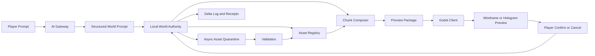
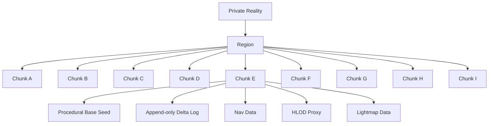
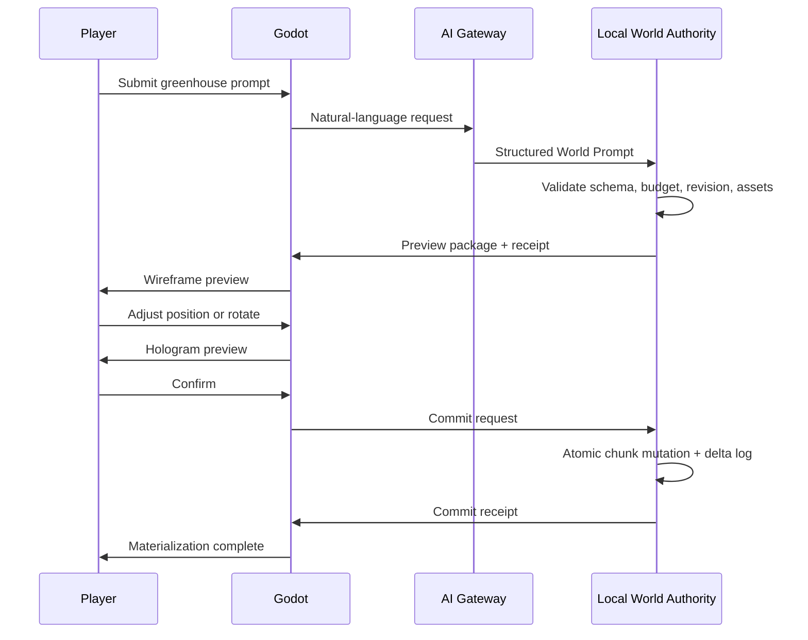

# Detailed System Design for AI-Autonomous Static 2.5D Open-World Scene Construction in AIdle

## Executive summary

The most implementable architecture for AIdle is **not** “AI generates arbitrary 3D worlds directly into the running game.” It is a **bounded AI-to-runtime construction system** in which AI produces a validated **Structured World Prompt**, a local authority service translates that prompt into approved assets and deterministic placement operations, and the Godot client previews and commits only those operations that pass schema, budget, collision, navigation, and style checks. This matches the AIdle product contract: conversation produces a structured proposal; preview is not authoritative reality; only validated, confirmed transactions become persistent state. fileciteturn0file20 fileciteturn0file21 fileciteturn0file23 fileciteturn0file25 fileciteturn0file26

For the engine branch, a greenfield implementation should pin to **Godot 4.7.1-stable** on **Windows 10/11 64-bit**, using the **Forward+** renderer as the primary desktop target. As of July 21, 2026, 4.7.1 is the current stable Godot release; Forward+ is Godot’s most advanced renderer and is intended for desktop platforms, while Vulkan/D3D12 are the modern rendering backends used by Forward+ and Mobile renderers. citeturn12search0turn12search2turn7search0turn7search6turn7search5

For content interchange, the default transport should be **glTF/GLB**, not FBX or ad hoc formats. Godot recommends glTF 2.0 for 3D scenes, Blender’s exporter supports meshes, PBR materials, textures, cameras, lights, extras/custom properties, skinning, and animation, and Khronos maintains the format as an ISO/IEC standard with an official validator and asset-auditor ecosystem. That combination makes GLB the most interoperable handoff format for a Blender-to-Godot asset pipeline. citeturn10search0turn2search0turn4search0turn4search3turn8search5turn9search0

The resulting design should favor **approved modular assets plus procedural composition** for runtime scene construction, while treating **asynchronously generated meshes** as an optional, slower path that must pass quarantine and validation before they can enter the approved catalog. This recommendation follows directly from the AIdle blueprints, which require provenance, human confirmation, rollback, revision-checked transactions, and clear boundaries between authoring systems and canonical world authority. fileciteturn0file5 fileciteturn0file20 fileciteturn0file21 fileciteturn0file24 fileciteturn0file25

## Architecture and trust boundaries

AIdle’s own design documents already define the right control model: **AI proposes, the authority validates, Godot renders and executes allowed effects**. The AI Game Master and Companion may propose dialogue, quests, pacing, mood, and build proposals, but they are not allowed to directly mutate scene tree state, persistence, collision, inventory, ownership, or marketplace data. That is the correct foundation for autonomous scene construction as well: the AI layer emits contracts, not side effects. fileciteturn0file21 fileciteturn0file25 fileciteturn0file28

The runtime should therefore be split into three hard boundaries.



This separation is consistent with AIdle’s contracts for Structured World Prompt, authority middleware, progressive construction, and the Blender Bridge architecture, which explicitly forbids arbitrary Python, shell access, direct template mutation, and direct copy from quarantine into the game catalog. fileciteturn0file5 fileciteturn0file23 fileciteturn0file25 fileciteturn0file26

The recommended implementation responsibilities are shown below.

| Module | Mandatory responsibilities | Must never do |
|---|---|---|
| **AI Gateway** | Intent extraction, style conditioning, proposal drafting, schema-constrained SWP output, asset query requests, explanation text for preview receipts | Mutate world state directly; choose unapproved files; run arbitrary scripts; bypass budget checks |
| **Local World Authority** | Schema validation, policy checks, revision check, asset resolution, placement solve, collision/nav feasibility, preview receipt, commit, rollback log | Accept unknown fields; commit stale revisions; trust AI-generated file paths; skip receipts |
| **Godot Client** | Render chunks, stream content, show wireframe/hologram/materialization, interaction UX, local save, profiling hooks | Authoritatively accept AI requests on its own; import quarantine assets behind the authority; let preview objects acquire ownership or collision authority |

This division is not only safer; it also stays aligned with the AIdle “single-contract invariant,” where free and paid AI transports must not fork save formats, mutation rules, or world semantics. Even in single-player desktop mode, the local authority should behave like a server-authoritative subsystem so that later multiplayer or shared-district work does not require rewriting persistence rules. fileciteturn0file21 fileciteturn0file25 fileciteturn0file28

A single-process desktop implementation is still appropriate for the first product. The key is to keep the boundary logical, even if the services run in the same executable or local companion process. The AIdle documents already define optimistic concurrency with `expected_world_revision`, idempotency with `request_id`, and undo as a compensating mutation rather than history erasure. Those rules should apply from day one, not after multiplayer. fileciteturn0file23 fileciteturn0file24 fileciteturn0file25

## Contracts and asset pipeline

The **Structured World Prompt** should remain the only authoritative proposal language. AIdle’s contract already specifies that the canonical machine contract must include identity/version, actor/session, operation, target, style profile, geometry/entity recipe, manifestation stages, interaction/collision/nav requirements, compute/content/policy budgets, provenance, and rollback/confirmation policy, while unknown fields must fail validation. fileciteturn0file23

A practical JSON Schema shape for scene construction can therefore look like this:

```json
{
  "$id": "world_prompt.schema.json",
  "type": "object",
  "additionalProperties": false,
  "required": [
    "schema_version",
    "request_id",
    "operation",
    "target",
    "style_profile",
    "scene_recipe",
    "manifestation",
    "budgets",
    "preview_policy",
    "rollback_policy",
    "provenance"
  ],
  "properties": {
    "schema_version": { "type": "string", "const": "1.1" },
    "request_id": { "type": "string" },
    "operation": {
      "type": "string",
      "enum": ["create_static_scene", "modify_static_scene", "delete_static_scene"]
    },
    "target": {
      "type": "object",
      "additionalProperties": false,
      "required": ["world_id", "chunk_ids", "expected_world_revision"],
      "properties": {
        "world_id": { "type": "string" },
        "chunk_ids": { "type": "array", "items": { "type": "string" } },
        "expected_world_revision": { "type": "integer", "minimum": 0 },
        "anchor_entity_id": { "type": ["string", "null"] }
      }
    },
    "style_profile": {
      "type": "object",
      "additionalProperties": false,
      "required": ["profile_id", "profile_version"],
      "properties": {
        "profile_id": { "type": "string" },
        "profile_version": { "type": "string" },
        "surrealism_budget": { "type": "number", "minimum": 0, "maximum": 1 }
      }
    },
    "scene_recipe": {
      "type": "object",
      "additionalProperties": false,
      "required": ["anchors", "placements"],
      "properties": {
        "anchors": {
          "type": "array",
          "items": {
            "type": "object",
            "additionalProperties": false,
            "required": ["anchor_type", "transform"],
            "properties": {
              "anchor_type": { "type": "string" },
              "transform": { "type": "array", "items": { "type": "number" }, "minItems": 10, "maxItems": 10 }
            }
          }
        },
        "placements": {
          "type": "array",
          "items": {
            "type": "object",
            "additionalProperties": false,
            "required": ["asset_query", "placement_mode"],
            "properties": {
              "asset_query": { "type": "string" },
              "placement_mode": { "type": "string", "enum": ["socket", "footprint", "scatter", "path_aligned"] },
              "variant_seed": { "type": "integer" },
              "must_be_walkable_around": { "type": "boolean" },
              "must_not_occlude_interaction_line": { "type": "boolean" }
            }
          }
        }
      }
    },
    "manifestation": {
      "type": "object",
      "additionalProperties": false,
      "required": ["stages"],
      "properties": {
        "stages": {
          "type": "array",
          "items": {
            "type": "string",
            "enum": ["WIREFRAME", "HOLOGRAM", "MATERIALIZING"]
          }
        }
      }
    },
    "budgets": {
      "type": "object",
      "additionalProperties": false,
      "properties": {
        "max_new_triangles": { "type": "integer" },
        "max_unique_materials": { "type": "integer" },
        "max_texture_bytes": { "type": "integer" },
        "max_nav_rebake_ms": { "type": "integer" }
      }
    },
    "preview_policy": {
      "type": "object",
      "additionalProperties": false,
      "properties": {
        "requires_player_confirmation": { "type": "boolean" }
      }
    },
    "rollback_policy": {
      "type": "object",
      "additionalProperties": false,
      "properties": {
        "undo_mode": { "type": "string", "enum": ["compensating_mutation"] }
      }
    },
    "provenance": {
      "type": "object",
      "additionalProperties": false,
      "properties": {
        "source_prompt": { "type": "string" },
        "generator_id": { "type": "string" },
        "parent_lineage": { "type": "array", "items": { "type": "string" } }
      }
    }
  }
}
```

The schema above is a proposed implementation shape, but it is intentionally aligned to the AIdle machine contracts, which already require request identity, revision checks, staged manifestation, budgets, provenance, preview/confirmation, and fixed stage order. fileciteturn0file21 fileciteturn0file23 fileciteturn0file25 fileciteturn0file26

The **Asset Registry** should be equally strict. It should not be a loose content database; it should be a runtime-facing declarative catalog that knows whether an asset is safe to place, lightmap, collide against, scatter with MultiMesh, or use as an HLOD proxy.

```json
{
  "asset_id": "cozy_greenhouse_droplet_a",
  "asset_type": "modular_building",
  "source_format": "glb",
  "catalog_path": "res://assets/approved/buildings/cozy_greenhouse_droplet_a.glb",
  "style_tags": ["cozy_cyber_pixel", "rounded", "greenhouse"],
  "bounds_m": [5.8, 4.2, 5.1],
  "footprint_polygon": [[-2.4, -1.8], [2.4, -1.8], [2.4, 1.8], [-2.4, 1.8]],
  "pivot_mode": "foot_center",
  "lods": [
    {"name": "lod0", "triangle_count": 14800},
    {"name": "lod1", "triangle_count": 7400},
    {"name": "lod2", "triangle_count": 2200},
    {"name": "hlod_proxy", "triangle_count": 320}
  ],
  "collider_profile": {
    "mode": "multiple_convex",
    "source": "approved_collision_children",
    "walkable_roof": false
  },
  "navigation_profile": {
    "blocks_navigation": true,
    "nav_cutout_margin_m": 0.25
  },
  "lighting_profile": {
    "lightmap_ready": true,
    "requires_uv2": true,
    "supports_probe_lighting": true
  },
  "instancing_profile": {
    "multimesh_allowed": false
  },
  "license": {
    "spdx": "LicenseRef-AIdle-Original",
    "source_authority": "AIdle Internal"
  },
  "validation": {
    "topology_passed": true,
    "uv_passed": true,
    "godot_import_smoke_passed": true,
    "qahash": "sha256:..."
  }
}
```

This schema follows both the AIdle Blender Bridge pattern and Khronos/Godot asset transport realities. Blender’s glTF exporter supports **extras/custom properties**, which is useful for metadata and anchors; Godot’s scene importer is built around importing full scenes rather than isolated arbitrary mesh blobs; and the Node Type Customization system allows collision and navigation intent to be embedded in imported scene names. fileciteturn0file5 citeturn2search0turn10search5turn10search6

For import routing, the production default should be **Blender scene → GLB → Godot scene importer**. Blender’s exporter is designed around glTF as a real-time delivery format, while Godot explicitly recommends glTF 2.0 and supports automated post-import customization, collision generation, navigation meshes, and auto-generated mesh LOD on scene imports. citeturn2search0turn10search0turn10search5turn1search2

The following import presets are the most useful starting point for the Desktop-first slice. They are recommendations built on Godot’s scene importer, name-suffix customization, auto mesh LOD, and Blender glTF export support. citeturn10search0turn10search5turn1search2turn2search0

| Preset | Intended use | Godot import stance | Collision stance | LOD/HLOD stance | Material stance |
|---|---|---|---|---|---|
| **Modular static building** | Houses, greenhouse shells, workshop modules | Import as scene, keep scene hierarchy, enable auto mesh LOD | Use approved convex collision children or `-convcolonly`; avoid raw trimesh unless the object is truly large and static | Auto LOD on import; manual HLOD proxy entry in registry | Externalized materials; one master stylized material family plus instance parameters |
| **Large static blocker** | Cliffs, retaining walls, terrain blockers | Import as scene | Simplified concave mesh only if one large static body is needed; otherwise split into convex groups | Manual HLOD proxy mandatory | Use atlased materials and baked normals |
| **Instanced foliage** | Grass tufts, flowers, pebbles, repeated shrubs | Import as scene or extracted mesh resource | Usually none, or simple low-cost hull for medium shrubs only | LOD mesh plus cluster-level visibility/HLOD | One or two materials maximum; vertex color variation |
| **HLOD proxy** | Distant chunk proxy | Import as scene with no gameplay nodes | None | Hand-authored very-low triangle proxy | Atlas-only and baked lighting tint where needed |
| **Collision or nav helper** | Invisible helper meshes | Imported with suffix-based conversion and then removed from final visible scene | `-colonly`, `-convcolonly`, `-navmesh`, `-noimp` | N/A | No runtime material |

The **asynchronous asset path** should leverage a Blender worker pool exactly as the AIdle character blueprint describes: schema-validated requests, template registry, approved operation registry, headless Blender workers, quarantine storage, technical validator, preview renderer, and approval gateway. The same approach that AIdle defined for characters is directly reusable for environment modules, if the operation set is extended from modular character assembly to modular static-scene authoring. fileciteturn0file5

For security, Blender jobs should run in background mode with auto-exec disabled. Blender documents `--background` execution and the `-Y` / `--disable-autoexec` flag for disabling automatic Python script execution, which is exactly the baseline needed for a controlled Blender Bridge worker. citeturn3search0turn3search1

## Procedural composition and chunk streaming

The scene builder should be **deterministic, chunk-local, and layered**. AIdle’s world model is already chunk-addressed, seeded, and reconstructed from a procedural base plus append-only player deltas, not from one giant mutable map. That implies a placement architecture where each chunk can be regenerated from its seed and style profile, then patched by validated manifest changes. fileciteturn0file21 fileciteturn0file24



For the Starter Realm, the cleanest starting configuration is **9 authored chunks** laid out as a 3×3 neighborhood, because that matches the “9 chunks, greenhouse prompt” slice while still training the project around streaming and locality instead of one monolithic scene. This also aligns with AIdle’s Starter Realm focus, fixed-angle 2.5D staging, and chunk-addressable persistence. fileciteturn0file2 fileciteturn0file13 fileciteturn0file14 fileciteturn0file20 fileciteturn0file24 fileciteturn0file30

A good scene-composition pipeline is a **seven-pass solver**.

First, generate or load the chunk’s immutable base surface, terrain rails, and authored camera corridor masks. Second, place landmark anchors such as the house, tree, pond, and greenhouse pad. Third, solve footprint blockers and walkable corridors. Fourth, lay path-aligned assets such as stepping stones, fences, and edge vegetation. Fifth, populate medium props using socket placement or footprint placement. Sixth, scatter foliage and pebble clutter using blue-noise or Poisson-like sampling with slope, occupancy, and camera-readability masks. Seventh, collapse eligible repeated assets into MultiMesh clusters and emit HLOD markers for distance tiers. This is the right place to use Bridson-style Poisson disk sampling for clean, non-clumping distribution, and to borrow the “global goals + local constraints” mindset from classic procedural city generation. citeturn14search4turn14search3turn14search0

For **scatter and repetition**, Godot’s MultiMesh system is the correct primitive for high-count identical meshes such as grass, flower patches, pebbles, and repeated shrubs. Godot documents MultiMesh as an efficient instancing mechanism for very large numbers of identical objects, even up to extremely large counts. The important caveat is equally important: MultiMesh does not support per-instance frustum culling, so visibility remains all-or-nothing at the MultiMesh level. In practice, that means you should partition each chunk’s scatter into several sub-clusters rather than one massive MultiMesh per biome. citeturn0search0turn16search0turn16search8turn16search7

For **occlusion**, the design should be conservative. Godot’s occlusion culling is useful, but it is CPU-driven, favors scenes with strong occlusion opportunities, and does not support truly dynamic occluders well. The documentation is explicit that complex occluders can strain the CPU, and that occlusion culling is most effective in indoor or room-heavy layouts. For AIdle’s open 2.5D desktop world, that means occlusion should be used on large authored blockers—house walls, dense workshops, cliff faces, bridge undersides—but not as the primary optimization mechanism for all outdoor foliage. Outdoors, visibility ranges, frustum culling, mesh LOD, and chunk residency tiers will pay off more reliably. citeturn0search1turn0search2turn0search4turn0search5

For **streaming**, Godot’s background resource loading should be the default path. `ResourceLoader.load_threaded_request` and the threaded status APIs exist specifically to avoid blocking the game while resources load. This is the right mechanism for chunk shell scenes, HLOD proxies, lightmap data, and decoration layers. citeturn1search7

The following chunk-residency model is a practical starting recommendation, inferred from the AIdle chunked-world contract, Godot’s background loading, HLOD, MultiMesh behavior, and the need to hold 60 FPS on desktop. It should be refined with profiler data before being frozen. fileciteturn0file24 citeturn1search7turn0search4turn1search2turn16search0

| Residency tier | World radius | Content loaded | Simulation | Typical use |
|---|---|---|---|---|
| **Active** | 3×3 around player | Full render scene, colliders, nav region, interaction anchors, foliage sub-clusters | Enabled | Immediate gameplay neighborhood |
| **Preloaded** | 5×5 around player | Chunk shell, LOD1/LOD2 meshes, texture handles, HLOD candidates, no heavy interaction scripts | Mostly disabled | Seamless near-future transition |
| **Proxy** | 7×7 optional vista ring | HLOD proxy only, no colliders, no nav, no interactivity | Disabled | Distant skyline and landmarks |
| **Unloaded** | Outside proxy ring | Nothing except seed and delta metadata | Disabled | Disk/catalog only |

A good **starter parameter set** is a **64 m × 64 m** chunk with **3×3 active**, **5×5 preloaded**, and optional **7×7 proxy** residency. For the Starter Realm vertical slice, you can simplify by keeping the full 3×3 authored realm loaded while still using the same residency code paths. That gives the project a production-ready streaming architecture without forcing aggressive streaming complexity in the first slice. fileciteturn0file24 fileciteturn0file30 citeturn1search7turn0search4turn1search2

For navigation, Godot’s runtime navigation system can parse source geometry from visual meshes, physics collision, or procedural arrays, but the docs are clear that visual mesh parsing stalls the rendering side and that **physics shapes are preferable** for runtime rebakes. That makes a strong case for storing simplified nav source per chunk and rebuilding only the local chunk or corridor affected by a committed static edit, rather than rebaking a whole scene from visual meshes. citeturn6search4turn6search7

## Rendering and performance envelope

AIdle’s visual target is already defined as **Cozy Cyber-Pixel / Dreamy Low-Poly 2.5D**: rounded silhouettes, warm light, readable three-quarter staging, matte tactile materials, restrained cyber accents, and a manifestation language of wireframe, translucent hologram, and deterministic material growth. The important technical implication is that quality should come from **shape language, composition, lighting, and material discipline**, not from sheer geometric density. fileciteturn0file2 fileciteturn0file13 fileciteturn0file14 fileciteturn0file22

On the rendering side, **Forward+** is the correct primary renderer because it is Godot’s most advanced renderer and is intended for desktop platforms. Forward+ also gives the project access to VoxelGI, which matters for high-quality preview and for optional runtime GI on newly committed but not-yet-lightmapped chunks. citeturn7search0turn7search6turn15search7

The material stack should stay narrow:

- a **master stylized environment shader** for most opaque surfaces,
- a **foliage wind shader** for grass, leaf cards, and hanging vines,
- a **hologram/materialization shader** for preview states,
- a very small number of special materials for water, glass, and emissive manifestation accents.

Godot’s StandardMaterial3D is a PBR material and can serve as the baseline for most runtime materials, while custom shaders should be reserved for the few places where the stylized look or animation genuinely requires them. That keeps material count, shader permutations, and draw overhead under control. citeturn1search0turn1search9

For lighting, the best-quality runtime path for **already approved static chunks** is **baked LightmapGI plus probes for dynamic actors**, because LightmapGI provides very high-quality indirect lighting at minimal runtime cost and LightmapProbe can light dynamic objects against baked scenes. However, Godot is explicit that LightmapGI baking is only available in the editor and is not suited to procedurally generated or user-built levels in exported builds. For newly committed player-authored chunks, that implies a two-phase lighting strategy: immediate commit uses direct lighting plus either VoxelGI or a simpler ambient/probe fallback; later, an editor-side or build-farm pass may bake final lightmaps for stable chunks. citeturn15search0turn1search4turn6search0turn15search7turn15search6

That hybrid strategy is especially important for the requested AI-autonomous scene builder: the system can still feel immediate and premium without violating Godot’s baked-lighting constraints. It simply means **final-lighting quality is part of the asynchronous approval pipeline**, not part of the first-frame preview path. citeturn15search0turn15search7turn15search9

The following performance targets are conservative **desktop-first production budgets** for the 1080p vertical slice. They are recommendations, not engine guarantees, and should be locked only after measurement in Godot’s Profiler and Visual Profiler. Godot’s Profiler exposes frame time, physics time, and script cost, while the Visual Profiler helps trace rendering bottlenecks on the CPU/GPU side. citeturn11search0turn11search4

| Metric | Medium preset target | High preset target |
|---|---:|---:|
| Resolution | 1920×1080 | 2560×1440 |
| Frame time | ≤ 16.67 ms average | ≤ 16.67 ms average |
| CPU game logic + authority | ≤ 6 ms average | ≤ 7 ms average |
| Physics | ≤ 2 ms average | ≤ 2.5 ms average |
| Rendering CPU | ≤ 4 ms average | ≤ 5 ms average |
| GPU frame | ≤ 10 ms average | ≤ 13 ms average |
| Visible triangles | 1.0–1.6 M typical | 1.6–2.4 M typical |
| Draw calls | 400–700 typical | 700–1,000 typical |
| Unique materials in visible set | ≤ 120 | ≤ 180 |
| Texture residency | ≤ 1.5 GB | ≤ 2.5 GB |
| Shadowed local lights | 2–3 active | 4–5 active |
| Simultaneously active dynamic NPCs in slice | 8–12 | 12–20 |

Those values are intentionally consistent with a stylized low-poly premium look rather than a photoreal benchmark. They also assume aggressive use of MultiMesh for high-count repetition, auto mesh LOD on imported scenes, manual visibility ranges for HLOD, and a restrained light/material count. Godot supports all of those features directly. citeturn1search2turn0search4turn0search0turn16search7

Because the camera is fixed three-quarter/isometric, AIdle gains a major performance advantage: the engine can pre-author **camera readability rules**. The design contract already requires house, player, and Companion silhouettes to remain readable, preview and committed states to be visually distinct, and non-color cues to exist. In technical terms, that means the chunk composer should reject placements that block interactive hotspots in the view corridor, and should add automatic cutaway or fade behavior only as a fallback—not as a substitute for good placement. fileciteturn0file2 fileciteturn0file22

## Preview, commit, and delta logging

AIdle’s progressive construction spec is unusually well-suited to autonomous static scene building because it already formalizes the preview lifecycle: `PROPOSED -> VALIDATED -> PREVIEWING -> CONFIRMED -> WIREFRAME -> HOLOGRAM -> MATERIALIZING -> COMMITTING -> COMPLETE`, with terminal alternatives for cancel, reject, rollback, and failure. That state machine should be implemented literally for environment construction. fileciteturn0file26

The **preview UX** for the greenhouse prompt should follow these stages.

The AI Gateway drafts the proposal. The authority validates it and resolves assets. Godot then renders a **cyan wireframe** to expose volume and sockets, followed by a **translucent hologram** for scale and style confirmation, and only then the **material growth** animation. Collision and ownership remain inactive until commit, exactly as the visual concept pillars and control blueprint require. fileciteturn0file6 fileciteturn0file14 fileciteturn0file22 fileciteturn0file26

A practical confirmation flow is shown below.



The control layer can map directly onto AIdle’s keyboard blueprint: `/` to open the prompt composer, `Ctrl+Enter` to send a prompt, `Tab` to enter build mode, `Q/R` to rotate, `Enter` to confirm, `Esc` or right-click to cancel, and `Ctrl+Z` to request rollback. These controls already exist in the uploaded desktop control contract and are specifically designed so destructive or persistent actions require confirmation. fileciteturn0file6

The missing piece is a **scene-transaction receipt** format. It should include enough data to reproduce the placement, compare revisions, and undo via compensating mutation.

```json
{
  "receipt_id": "rcpt_sr_greenhouse_0001",
  "request_id": "req_sr_greenhouse_0001",
  "world_id": "private_reality_001",
  "world_revision_before": 12,
  "world_revision_after": 13,
  "chunk_ids": ["r0_c0", "r0_c1"],
  "state": "COMPLETE",
  "created_entities": [
    {
      "entity_id": "ent_greenhouse_01",
      "asset_id": "cozy_greenhouse_droplet_a",
      "transform": [15.6, 0.0, 10.8, 0.0, 35.0, 0.0, 1.0, 1.0, 1.0],
      "collider_state": "enabled_after_commit",
      "nav_update": "local_cutout_rebake"
    }
  ],
  "preview_hash": "sha256:preview_pkg...",
  "delta_log_hash": "sha256:delta_patch...",
  "rollback": {
    "mode": "compensating_mutation",
    "rollback_request_id": "req_undo_sr_greenhouse_0001"
  },
  "provenance": {
    "generator_id": "gateway_v1",
    "source_prompt": "Create a small droplet greenhouse with a plant-care robot and lights that glow at night."
  },
  "timestamps": {
    "proposed_at": "2026-07-21T10:20:11+07:00",
    "confirmed_at": "2026-07-21T10:20:25+07:00",
    "committed_at": "2026-07-21T10:20:26+07:00"
  }
}
```

This receipt style is a direct extension of AIdle’s commit rules, request-idempotency rules, revision checking, and provenance requirements. Undo must create a compensating mutation rather than deleting history. Duplicate requests must return the prior receipt instead of creating duplicate entities. fileciteturn0file21 fileciteturn0file23 fileciteturn0file25 fileciteturn0file26

The **quarantine and validation gate** should reject or warn on the following checks. This table is a direct implementation recommendation based on the AIdle Blender Bridge validator list, Godot’s collision/nav import rules, LightmapGI requirements, and Khronos guidance on GPU-friendly real-time assets. fileciteturn0file5 citeturn10search5turn17search1turn15search0turn8search1turn9search0

| Check | Rule | Action on fail |
|---|---|---|
| Schema compliance | No unknown fields; all required fields present | Reject |
| Source path safety | No absolute paths, path traversal, or unmanaged external references | Reject |
| File format | Valid `.glb` / `.gltf`; official validator passes | Reject |
| Topology | No severe non-manifold geometry; no degenerate triangle explosions; no broken normals | Reject |
| Triangle budget | Stay within asset-class thresholds and declared registry budget | Reject or downgrade |
| UV0 | No catastrophic overlaps for textured surfaces; padding sufficient to reduce mip bleed | Reject |
| UV2 for baked assets | Required if `lightmap_ready = true` | Reject |
| Materials | Material count within class budget; no unsupported shader graphs in export path | Reject or warn |
| Collision | Approved convex or simplified concave profile exists where required | Reject |
| LOD/HLOD | LODs present for all non-trivial static assets; HLOD proxy for large landmarks | Reject or warn |
| License and provenance | SPDX or internal source authority present; traceable origin | Reject |
| Godot smoke import | Imports without critical warnings; transform, scale, extras, and hierarchy preserved | Reject |

## Vertical slice implementation and source stack

The vertical slice should implement exactly one promised scenario: the **Starter Realm** in a 3×3 chunk layout, with the player able to issue the Cozy Cyber-Pixel greenhouse prompt, preview it, reposition it, confirm it, save/reload it, and undo it. This scope is already structurally present in the AIdle design contract, Cozy world specifications, openworld blueprint, and roadmap gates. fileciteturn0file2 fileciteturn0file13 fileciteturn0file14 fileciteturn0file20 fileciteturn0file30

The implementation sequence below is the most direct path to a professional, testable slice.

First, lock the engine and toolchain: Godot 4.7.1-stable, Blender 4.x stable production branch, GLB as the interchange target, and Windows 10/11 64-bit as the only shipping platform for the slice. Freeze the coordinate convention, unit scale, naming suffixes, and schema versions before content authoring begins. citeturn12search0turn12search2turn10search0turn2search0turn8search1

Second, build the **chunk shell runtime** in Godot: fixed camera, player movement, prompt UI, chunk residency manager, background loader, debug overlay, and profiler hooks. The shell should already support active/preload/proxy chunk tiers, even if the slice loads only the 3×3 starter neighborhood. fileciteturn0file30 citeturn1search7turn0search4turn11search0turn11search4

Third, create the **Starter Realm asset kit** in Blender and export it to GLB: modular cozy house, greenhouse shell variants, path stones, planter boxes, pond edge pieces, one landmark tree, light brush pad, garden robots, and background shrubbery. Asset metadata should include suffix-based helper nodes for collision and navigation where appropriate. fileciteturn0file13 fileciteturn0file14 fileciteturn0file5 citeturn10search5turn2search0

Fourth, implement the **authority service** locally: SWP parser, schema validator, asset resolver, placement solver, chunk mutation builder, preview receipt generator, commit service, and delta log. This should run before any AI integration logic is considered “done.” fileciteturn0file21 fileciteturn0file23 fileciteturn0file25

Fifth, implement the **preview ladder**: wireframe volume, hologram volume, confirm/cancel receipt, and deterministic materialization. At this stage, collision must still be withheld until commit, because that is a core invariant of the design and one of the slice acceptance criteria. fileciteturn0file22 fileciteturn0file26 fileciteturn0file14

Sixth, wire in the **greenhouse transaction**. The sample prompt from the AIdle world specs—“Create a droplet-shaped greenhouse with a plant-care robot and small lights that glow at night”—should resolve to a bounded set of approved greenhouse assets, path snaps, decorative lamps, and one spawn anchor for a pre-made helper robot such as Nori-7; it should not invoke runtime character generation. fileciteturn0file13 fileciteturn0file14 fileciteturn0file7 fileciteturn0file8

Seventh, add **save/reload and undo**. The authoritative test is simple: build the greenhouse, restart the game, confirm that the same entity IDs and provenance reload, then issue undo and confirm that colliders, nav cutouts, and entity records disappear through compensating mutation with no duplicates or orphan data left behind. fileciteturn0file25 fileciteturn0file26 fileciteturn0file30

Eighth, profile and trim until the slice sustains the frame budget on the target desktop. Use Godot’s Profiler for frame, physics, idle, and script time; use the Visual Profiler for rendering bottlenecks; and use a native Windows profiler if engine-level hotspots become ambiguous. Only after the slice is comfortably inside budget should the team expand scene density or shader complexity. citeturn11search0turn11search4turn11search3

The final source/tool stack should be prioritized as follows.

| Priority | Tool or source | Why it should be first-class |
|---|---|---|
| **Highest** | **AIdle SSOT blueprints and contracts** | They define the authoritative product behavior, world-prompt semantics, authority rules, manifestation invariants, and roadmap gates. fileciteturn0file20 fileciteturn0file21 fileciteturn0file23 fileciteturn0file25 fileciteturn0file26 fileciteturn0file30 |
| **Highest** | **Godot official docs** | Essential for renderer selection, scene import, suffix automation, threaded loading, MultiMesh, visibility ranges, mesh LOD, LightmapGI/VoxelGI, collision, navigation, and profiling. citeturn7search6turn10search0turn10search5turn1search7turn0search4turn1search2turn15search0turn15search7turn17search1turn11search0turn11search4 |
| **Highest** | **Blender official docs** | Required for headless worker execution, glTF export behavior, and safe worker invocation. citeturn3search0turn3search1turn2search0 |
| **Highest** | **Khronos glTF spec, validator, and asset guidelines** | Needed for format correctness, QA automation, UV/material/instancing guidance, and long-term interoperability. citeturn4search3turn4search0turn8search5turn9search0turn8search1 |
| **High** | **Bridson 2007** | Best lightweight primary reference for Poisson-disk scatter and blue-noise placement. citeturn14search4 |
| **High** | **Parish and Müller 2001** | Strong reference for global-goal/local-constraint procedural placement. citeturn14search3 |
| **High** | **Papavasiliou 2015** | Useful reference for dense procedural object distribution and continuous LOD ideas in terrain contexts. citeturn14search0 |
| **Medium** | **Khronos Asset Auditor** | Helpful for continuous asset QA in CI even beyond strict validator checks. citeturn8search6turn8search5 |

The implementable conclusion is straightforward: **make AI a planner, not a renderer; make the authority a contract enforcer, not a suggestion engine; make Godot the only system that can turn approved plans into committed chunk mutations**. That architecture is consistent with the uploaded AIdle materials, with Godot’s actual strengths on desktop, and with a production-minded GLB/validation pipeline that can deliver static high-quality 2.5D open-world scenes without sacrificing performance, provenance, or safety. fileciteturn0file20 fileciteturn0file21 fileciteturn0file23 fileciteturn0file25 fileciteturn0file26 citeturn12search0turn7search6turn10search0turn9search0