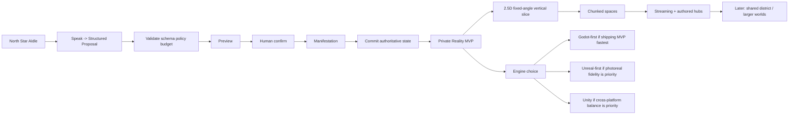
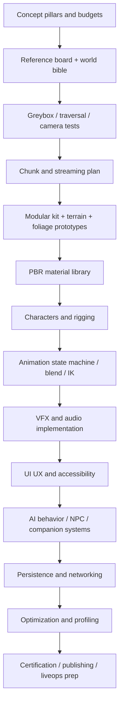
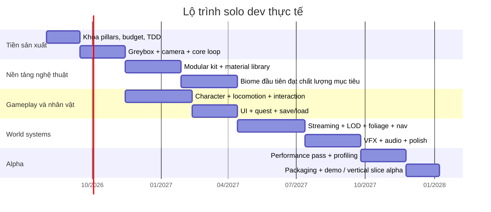
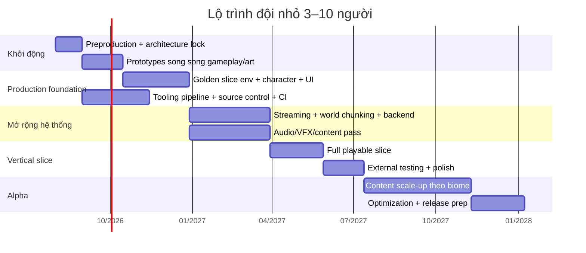

# Báo cáo nghiên cứu chuyên sâu về xây dựng game open-world high-fidelity kiểu AIdle cho solo dev và đội nhỏ

## Tóm tắt điều hành

Nếu mục tiêu là một game **“AIdle style” thực sự có thể ship được bởi một cá nhân hoặc đội nhỏ**, kết luận quan trọng nhất là: **không nên bắt đầu bằng một “siêu open world” seamless theo kiểu AAA truyền thống**. Blueprint AIdle đính kèm đã khóa hướng đi của MVP vào một **vertical slice 2.5D Private Reality**, camera cố định, loop xác nhận-manifest-commit có kiểm soát, và hạ tầng authoritative cho trạng thái bền vững; điều này ngụ ý rằng sản phẩm nên đi theo lộ trình **chunked world, hub-based, authored biomes, procedural assistance vừa đủ**, thay vì một bản đồ liên tục khổng lồ ngay từ đầu. fileciteturn0file7 fileciteturn0file8 fileciteturn0file11 fileciteturn0file12 fileciteturn0file13 fileciteturn0file17

Về lựa chọn công nghệ, **Unreal Engine 5** là lựa chọn mạnh nhất nếu ưu tiên hàng đầu là **độ trung thực hình ảnh cao, workflow open-world trưởng thành, foliage/streaming/HLOD tích hợp chặt chẽ**, nhờ Nanite, Lumen, World Partition, HLOD và PCG. **Unity 6** là phương án trung gian tốt khi bạn muốn **cross-platform rộng, pipeline quen thuộc, kiểm soát tốt hơn chi phí runtime/asset streaming**, nhưng nó không “gói sẵn” một stack large-world photoreal mạnh bằng Unreal. **Godot 4.x** phù hợp nhất cho **MVP 2.5D, stylized hoặc semi-realistic vừa phải, kiểm soát codebase gọn, chi phí giấy phép thấp**, và đặc biệt phù hợp với roadmap AIdle đính kèm vốn đã giả định “Godot 2.5D shell” trước. citeturn7search0turn8search2turn8search5turn8search0turn10search0turn11search8turn13search5turn14search0turn14search1turn21search0turn22search0turn2search7 fileciteturn0file15 fileciteturn0file17

Khuyến nghị thực tế nhất là chia làm **hai chiến lược rõ ràng**. Nếu bạn muốn bám sát AIdle blueprint và tối đa khả năng hoàn thành, hãy chọn **Godot 4.x + Blender + Substance tùy chọn + FMOD + authoritative backend như Nakama** cho vertical slice, rồi chỉ nâng cấp sang scope 3D/open-world lớn hơn sau khi core loop đã được chứng minh. Nếu bạn muốn ngay từ đầu nhắm tới **“professional high-fidelity open-world”** và chấp nhận rủi ro kỹ thuật cao hơn, hãy dùng **Unreal Engine 5 + Blender + Substance 3D + Houdini + SpeedTree + Fab/Megascans + FMOD/Wwise + backend authoritative**. Với cả hai hướng, nền tảng asset nên giữ nguyên nguyên tắc: **DCC tạo mesh/material/anchors; game engine mới là nơi sở hữu gameplay triggers, authority, streaming, nav, persistence**. citeturn19search0turn19search2turn19search3turn25search0turn25search4turn24search0turn24search2turn6search0turn5search1turn5search7 fileciteturn0file3 fileciteturn0file4 fileciteturn0file5 fileciteturn0file6

Điểm mấu chốt cuối cùng là **tư duy sản xuất**. Solo dev hoặc team 3–10 người chỉ thành công với open-world khi: khóa chặt art direction; đặt performance budget từ tuần đầu; giới hạn số biome; dùng procedural để tăng tốc **authoring** chứ không thay thế game design; và chỉ đưa multiplayer/persistence authoritative vào sau khi single-player slice chạy vững. Chính roadmap AIdle cũng đặt mốc authority/multiplayer sau các gate về vertical slice, persistence, Companion và performance. fileciteturn0file17 fileciteturn0file12

## Hàm ý chiến lược từ blueprint AIdle

Blueprint đính kèm không mô tả một MMO hoặc metaverse “vô hạn” cần làm ngay; nó mô tả một hệ thống nơi người chơi **nói ra ý định**, hệ thống tạo **structured proposal**, đi qua **policy/schema validation**, hiển thị **preview**, yêu cầu **human confirm**, rồi mới **manifest** và **commit** thành trạng thái bền vững. Hướng đi này gần với “persistent authored sandbox” hơn là “huge seamless simulation first”. Nó làm thay đổi toàn bộ cách bạn chọn engine, kiến trúc dữ liệu và chiến lược content. fileciteturn0file8 fileciteturn0file10 fileciteturn0file12 fileciteturn0file13

Blueprint cũng khóa rất rõ **MVP truth**: sản phẩm đầu tiên là **một vertical slice 2.5D Private Reality**; các tham vọng như “infinite metaverse”, thành phố thực, space travel và text-to-3D tự do đều để ở horizon xa hơn. Đồng thời, “Reality Hierarchy” nói không làm một thế giới đơn khối mà chia thành **addressable chunks**, procedural base dựng lại bằng seed, còn thay đổi của người chơi được dựng lại bằng delta log append-only. Đây là tín hiệu mạnh rằng **streaming theo cell/chunk** là mô hình đúng, bất kể bạn dùng Unreal, Unity hay Godot. fileciteturn0file7 fileciteturn0file11

Về mỹ thuật, tài liệu “Visual Concept Pillars” đặt nền ở **Cozy Cyber-Pixel / Dreamy Low-Poly 2.5D**, với silhouette tròn, warm light, hình khối dễ đọc, và surrealism chỉ là lớp authored có budget rõ ràng. Vì vậy, nếu bạn cố nhảy thẳng sang photoreal open-world kiểu “The Matrix Awakens” hoặc city simulation đầy đủ, bạn đang đi lệch khỏi sản phẩm gốc. Thay vào đó, một chiến lược thông minh là: **dùng workflow high-fidelity cho landmark, material, foliage, lighting và cinematic presentation**, nhưng giữ cách tổ chức gameplay, camera, chunking và authority theo blueprint. fileciteturn0file9 fileciteturn0file1 fileciteturn0file2 fileciteturn0file3

Tài liệu world kits còn cho thấy một nguyên tắc cực kỳ quan trọng cho pipeline: Blender hoặc DCC nên xuất **mesh vật lý + arcane metadata/anchors**, nhưng **triggers, conditions, sound, gameplay effects, recovery logic** phải thuộc về engine runtime. Đây là best practice rất hợp với sản xuất open-world bởi vì nó tách **nội dung nghệ thuật** khỏi **authority logic**, giúp version control, QA và rollback dễ hơn nhiều. fileciteturn0file3 fileciteturn0file4 fileciteturn0file5

Đặc biệt đáng chú ý là world Oceanpunk được để cuối vì **underwater lighting, occlusion và navigation cần prototype runtime và profiling riêng**. Đây là một ví dụ rất hay về tư duy scope control: không phải biome nào cũng “đắt” như nhau, và biome nào yêu cầu mô hình render hoặc traversal đặc biệt thì phải bị trì hoãn đến sau khi pipeline cơ bản đã vững. fileciteturn0file6



## Chọn engine và bộ công cụ

### Khuyến nghị engine theo mục tiêu sản phẩm

Đối với **high-fidelity open-world** theo nghĩa hình ảnh, công nghệ, foliage, terrain, lighting, cinematic và sample ecosystem, **Unreal Engine 5.8** đang là lựa chọn mạnh nhất cho đội nhỏ vì Epic đã tích hợp sẵn nhiều khối large-world quan trọng: **Nanite** để xử lý geometry chi tiết với streaming mịn; **Lumen** cho GI/reflections động; **World Partition** để chia thế giới thành cell; **HLOD** để thay cell unloaded bằng proxy; và **PCG** để procedural authoring gắn với partition streaming. Đây là tổ hợp rất khó tái tạo đồng mức trưởng thành trong Unity hoặc Godot nếu bạn chỉ có vài người. citeturn7search0turn0search5turn0search0turn8search2turn8search5turn0search2turn8search1

Tuy nhiên, đối với **AIdle đúng theo blueprint hiện tại**, **Godot 4.x** lại là lựa chọn hợp logic hơn cho MVP. Godot có license MIT, editor nhẹ, codebase gọn, và đã có sẵn Mesh LOD, Visibility ranges kiểu HLOD, occlusion culling, GPUParticles3D và demo projects chính thức. Quan trọng hơn, roadmap tài liệu đính kèm đã explicitly đặt “Godot 2.5D shell” làm gate G2 trước khi nói tới authority, art/performance hay các horizon xa hơn. Điều đó nghĩa là nếu bạn đổi sang Unreal từ đầu, bạn nên hiểu rõ rằng mình đang **đổi chiến lược sản phẩm**, không chỉ đổi công cụ. citeturn14search0turn14search1turn0search1turn14search8turn28search4turn21search0turn2search7turn32search0turn20search1 fileciteturn0file17

**Unity 6** đứng giữa hai đầu này. Nó có editor phổ biến, hệ sinh thái middleware lớn, LOD Group, Occlusion Culling, Addressables, VFX Graph, Netcode for GameObjects và pipeline tốt cho nhiều nền tảng. Nhưng nếu bạn hỏi “đội 3–10 người nào dễ dựng **môi trường open-world photoreal** nhất, ít phải ghép thêm hệ thống nhất?”, câu trả lời vẫn nghiêng về Unreal. Unity hợp hơn khi bạn muốn **cross-platform rộng, art style trung tính/stylized/semi-real, và quy trình asset streaming có chủ đích rõ ràng**. citeturn10search0turn11search8turn13search5turn22search0turn23search0turn30search1

### Bảng so sánh engine

Bảng dưới đây là tổng hợp từ tài liệu chính thức hiện hành của Epic, Unity và Godot, cộng với blueprint AIdle để đánh giá mức phù hợp thực tế cho sản phẩm này. citeturn21search1turn1search2turn22search0turn1search0turn2search7turn14search1turn10search0turn11search8turn23search0 fileciteturn0file17

| Engine | Phù hợp nhất khi nào | Điểm mạnh chính | Điểm yếu / rủi ro | Chi phí / license |
|---|---|---|---|---|
| **Unreal Engine 5.8** | Muốn hình ảnh high-fidelity, foliage nặng, world streaming, cinematic, sample ecosystem mạnh | Nanite, Lumen, World Partition, HLOD, PCG, MetaHuman, Niagara, Unreal Insights, sample như Electric Dreams/City Sample/Lyra | Editor nặng; build times lớn; pipeline có thể quá sức solo; mobile path không phải điểm mạnh cho photoreal lớn | Miễn phí dưới **$1M gross product revenue**, sau đó royalty **5%** trên phần doanh thu vượt ngưỡng; EGS revenue được miễn royalty theo trang license chính thức. citeturn1search2 |
| **Unity 6** | Muốn cân bằng visual, cross-platform và hệ sinh thái middleware | Addressables, LOD Group, Occlusion Culling, NGO, VFX Graph, Asset Store lớn, editor quen thuộc | Large-world photoreal cần ghép nhiều piece hơn; HDRP/URP/mobile split tăng complexity | Personal miễn phí tới **$200K** doanh thu + funding năm; Pro **$2,310/năm/seat** trong 2026; Enterprise custom. citeturn1search0turn1search3 |
| **Godot 4.x** | MVP 2.5D/3D gọn, stylized, kiểm soát codebase, không muốn gánh phí license | MIT, nhẹ, thao tác nhanh, source mở, Mesh LOD/HLOD/occlusion/particles có sẵn, demo projects chính thức | Ecosystem open-world high-fidelity nhỏ hơn; nhiều workflow phải tự lắp; console cần vendor/support path riêng | Miễn phí, mã nguồn mở MIT, dùng thương mại được. citeturn2search7turn21search0 |

### Bộ công cụ DCC và middleware nên dùng

Đối với DCC, bộ khung hiệu quả nhất cho đội nhỏ hiện nay là **Blender + Substance 3D + Houdini chọn lọc + SpeedTree khi foliage là trọng tâm + Fab/Megascans cho scan assets**. Blender vẫn là xương sống hợp lý nhất cho modeling, retopo, UV, rigging cơ bản và export; Substance 3D cho texturing/material authoring; Houdini dành cho terrain tools, scatter, roads, modular procedural kits và data-driven placement; SpeedTree dành cho cây cối có wind/LOD/culling workflow tốt; Fab là nơi lấy asset đa engine với license chuẩn hóa hơn, còn Megascans giờ cần hiểu theo mô hình Fab chứ không nên giữ giả định cũ “UE luôn miễn phí trọn thư viện mãi mãi”. citeturn21search4turn15search0turn2search5turn15search7turn3search0turn3search8turn19search2turn16search0turn16search2turn6search0turn5search0turn5search1

Về audio, **FMOD** là lựa chọn thực dụng nhất cho indie/small team vì tích hợp tốt với Unreal và Unity, có docs rõ, và workflow adaptive audio hiệu quả. **Wwise** rất mạnh cho dự án lớn, nhưng trên phương diện “time-to-first-good-result” thì FMOD thường hợp đội nhỏ hơn. Nếu game cần voice chat thời gian thực, có thể cân nhắc **ODIN** cho Unreal/Unity thay vì tự xây giải pháp VoIP. citeturn25search0turn25search4turn25search10turn26search2turn25search8turn25search3

Về networking/persistence, nếu bạn làm theo mô hình AIdle với authoritative validation, idempotent request, revision check và durable online state, **Nakama** là một lựa chọn phù hợp vì nó hỗ trợ **server-authoritative multiplayer**, custom match logic, tick rate tùy chỉnh và backend gameplay validation. Với Unity, NGO là netcode layer cho GameObject workflow, nhưng NGO **không thay thế backend persistence authoritative**; bạn vẫn cần service riêng cho state bền vững. citeturn24search0turn24search1turn24search2turn23search0 fileciteturn0file12

### Bảng so sánh công cụ hỗ trợ

Bảng dưới đây là lựa chọn “default stack” thực tế cho indie đến small team. Giá và license thay đổi theo vùng hoặc theo tier doanh thu, nên coi đây là ảnh chụp chính sách công khai hiện hành chứ không phải báo giá cố định. citeturn21search4turn2search5turn3search0turn3search8turn4search6turn6search0

| Công cụ | Vai trò tốt nhất | Khuyến nghị sử dụng | Chi phí / license hiện hành |
|---|---|---|---|
| **Blender** | Modeling, UV, rigging, basic animation, baking, scene prep | Mặc định cho mọi team trừ khi đã có Maya/Max pipeline | Miễn phí, mã nguồn mở. citeturn21search4 |
| **Substance 3D Painter / Designer / Sampler** | PBR texturing, material authoring, scan cleanup | Rất nên dùng cho high-fidelity hoặc stylized có chất liệu rõ | Gói cá nhân từ khoảng **€57.95/tháng**, team **€95.99/tháng/seat** ở bảng giá EU hiện hành; thay đổi theo vùng. citeturn2search2turn2search5 |
| **Houdini Indie** | Terrain tools, road/city generation, scatter, procedural kits, HDA tools | Chỉ dùng cho phần sinh năng suất cao; không dùng để “tạo cả game bằng procedural” | **$299/năm**, giới hạn indie dưới **$100K** annual gross revenue và funding < **$1M** trong 24 tháng, tối đa 3 license/studio. citeturn3search0 |
| **Houdini Engine for Unreal/Unity** | Chạy HDA trong editor | Rất nên dùng nếu chọn Unreal-heavy pipeline | Plugin miễn phí; commercial license cho Unreal/Unity path được SideFX cung cấp miễn phí theo docs hiện hành. citeturn3search8turn3search6 |
| **SpeedTree** | Cây, foliage, wind, LOD | Nên dùng nếu game có rừng dày hoặc vegetation là key visual | Tier theo doanh thu/funding: Learning, Indie, Pro, Enterprise. Rights và giới hạn khác nhau theo tier. citeturn4search6 |
| **Fab / Megascans** | Asset scans, environments, surfaces, audio, plugins | Tốt để tăng tốc prototype và production, nhưng phải quản license theo asset | Fab Standard License cho phép dùng thương mại, private và trên bất kỳ tool tương thích; không được resale asset standalone. Megascans trên Fab không còn mặc định miễn phí vô hạn cho UE như giả định cũ. citeturn6search0turn5search0turn5search1 |
| **FMOD** | Adaptive music, ambience, SFX routing | Mặc định khuyến nghị cho indie/small team | Integration miễn phí; phát hành cần license FMOD phù hợp. citeturn25search0turn25search10 |
| **Nakama** | Auth, matchmaking, authoritative state, persistent game backend | Tốt cho co-op/shared space/persistent authoritative loop | Core open-source; chi phí vận hành tùy self-host/cloud. Authoritative model được docs hỗ trợ rõ. citeturn24search0turn24search2 |

## Yêu cầu phần cứng và phần mềm

### Cấu hình chính thức và cấu hình làm việc thực tế

Về mặt official requirements, Unreal Engine khuyến nghị **32 GB RAM**, GPU **8 GB VRAM trở lên**, CPU quad-core 2.5 GHz+, và cho Nanite/Lumen nên dùng DX12/SM6; Blender khuyến nghị **32 GB RAM** và GPU **8 GB VRAM**; Unity 6 khuyến nghị tối thiểu **8 GB RAM** nhưng các project lớn sẽ cần hơn nhiều; Godot nhẹ hơn đáng kể và editor có thể chạy trên máy yếu hơn. Nanite còn khuyến nghị dùng **SSD** vì dựa vào streaming geometry từ disk. citeturn21search1turn7search0turn22search0turn21search4turn21search0

Từ yêu cầu chính thức đó, có thể suy ra ba tier máy làm việc thực tế như sau. Đây là **cấu hình gợi ý suy luận**, không phải cấu hình official duy nhất. Nó được tối ưu cho sản xuất game, không phải chỉ để “mở được editor”. citeturn21search1turn22search0turn21search4turn21search0

| Tier | CPU | RAM | GPU | Lưu trữ | Phù hợp |
|---|---|---|---|---|---|
| **Indie tối thiểu nghiêm túc** | 6–8 core hiện đại | 32 GB | RTX 3060 12 GB / RX 6700 XT class | NVMe SSD 1–2 TB | Godot/Unity thoải mái, Unreal ở mức environment vừa phải, bake/light authoring cơ bản, Substance/Blender ổn |
| **Indie mạnh / small team workstation** | 8–12 core | 64 GB | RTX 4070 Super / 4070 Ti / RX 7900 GRE class, 12–16 GB VRAM | NVMe 2 TB hệ thống + 2 TB project/cache | Unreal high-fidelity, MetaHuman vừa phải, Houdini scatter/terrain, texture baking và profiling tốt |
| **Pro indie / lead tech-art workstation** | 16 core trở lên | 96–128 GB | RTX 4080/5080 class trở lên, 16 GB+ VRAM | NVMe 2 TB OS + 4 TB project/DDC/cache | Large world UE, Houdini nặng, nhiều editor/tool cùng lúc, build cache, cinematic, crowd/veg dense |

### Cấu hình theo vai trò trong đội

Không phải ai trong team cũng cần một máy như nhau. Artist môi trường và tech artist procedural sẽ hưởng lợi từ nhiều RAM, nhiều VRAM và SSD lớn hơn lập trình gameplay thuần. Ngược lại, gameplay programmer có thể làm việc rất hiệu quả với máy tầm trung nếu project đã có shared DDC, proxy assets và cooked-test workflow tốt. Với Unreal, Epic còn khuyến nghị nếu không có Incredibuild thì máy compile nên có **12–16 cores**; còn Blender và Substance sẽ hưởng lợi rõ rệt từ VRAM và RAM khi làm texture set lớn hoặc sculpt/bake phức tạp. citeturn21search1turn21search4turn2search5

### Yêu cầu phần mềm, quản trị dự án và versioning

Bộ software chuẩn cho một team làm open-world nên gồm: game engine; Blender; Substance; Git với LFS hoặc Perforce; issue tracker; công cụ integration audio; công cụ build automation/CI; và một quy ước versioning rõ ràng cho assets/procedural outputs. Với Unreal, shared DDC sẽ giảm rất nhiều thời gian build Nanite/shader; với Unity, Addressables và build profiles nên được đưa vào từ sớm; với Godot, việc quản branch demo/prototype và production branch có ý nghĩa lớn vì đội nhỏ dễ “merge scope” vào cùng một scene tree. citeturn7search0turn11search8turn9search4turn14search8

## Pipeline và workflow kỹ thuật

### Pipeline đầu-cuối từ concept đến phát hành

Pipeline tối ưu cho một open-world indie không phải là pipeline “AAA thu nhỏ”; nó phải là pipeline **nén quyết định sớm, chuẩn hóa metadata, và profile liên tục**. Một flow đầu-cuối hợp lý là: khóa pillars và budgets; dựng greybox/hub chunk đầu tiên; xác lập style guide và modular kit; dựng terrain/foliage/material baseline; triển khai nhân vật, camera, animation, combat/traversal; thêm VFX/audio/UI; rồi mới đến persistence/networking/publishing. Nếu AIdle là sản phẩm đích, loop AI/Game Master/Companion phải đi qua gateway schema validation và authoritative commit đúng như blueprint, không để AI viết thẳng vào canonical world state. fileciteturn0file8 fileciteturn0file10 fileciteturn0file12 fileciteturn0file15



### Môi trường chi tiết cao

#### Terrain, foliage, LOD, streaming, culling

Với **Unreal**, workflow môi trường hiệu quả nhất cho đội nhỏ là: terrain base bằng Landscape hoặc heightfield/Houdini; chia world bằng **World Partition**; sinh foliage ở hai tầng, gồm “authored hero placement” và “systemic fill” bằng **PCG**; build **HLOD** cho cell unloaded; dùng **Nanite** cho rocks/cliffs/hero meshes và foliage hỗ trợ phù hợp; kiểm soát lighting bằng **Lumen** ở PC/console target cao. Epic mô tả rõ World Partition chia map theo lưới cell và hỗ trợ HLOD cho các cell không tải, còn PCG partitioned generation giúp dữ liệu procedural được chia theo grid để stream cùng World Partition. citeturn8search2turn8search5turn0search2turn8search1turn7search0turn0search5turn0search0

Với **Unity**, workflow tương đương là Terrain + Trees/Details + **LOD Group** + **Occlusion Culling** + **Addressables**. Unity nói rất rõ rằng occlusion culling hoạt động tốt nhất ở scene có các vùng nhỏ, ngăn bởi vật cản rõ; Trees có cơ chế chuyển từ mesh sang billboard theo khoảng cách; và Addressables cho phép tải asset bất đồng bộ từ local hoặc remote kèm dependency management. Nói cách khác, Unity có đủ mảnh ghép, nhưng bạn phải tự ghép chúng thành chiến lược world streaming chặt chẽ hơn so với Unreal. citeturn10search0turn12search6turn13search1turn11search8

Với **Godot**, bộ ba cần nắm là **automatic Mesh LOD**, **Visibility ranges (HLOD)** và **Occlusion Culling**. Docs của Godot nhấn mạnh rằng LOD import tự động và HLOD thủ công hiệu quả nhất khi dùng cùng nhau; occlusion culling cho lợi ích đáng kể trong scene indoor hoặc bố cục có nhiều che khuất; còn với outdoors ít cơ hội occlusion thì CPU cost có thể không đáng. Một lưu ý rất thực tế từ Godot là **MultiMesh không nên gom các instance ở quá xa nhau vào chung một node**, vì khi đó frustum/occlusion culling không thể loại từng cụm riêng. Điều này áp dụng trực tiếp cho cách bạn chia rừng, làng, cột đèn và props theo chunk. citeturn14search0turn14search1turn0search1turn14search8turn20search1turn20search2

Từ ba hệ trên, quy tắc sản xuất chung là: **không để một mesh quá lớn đại diện cho cả cụm world**, vì như Unity docs chỉ ra, occlusion tốt cần geometry được chia sensibly; và như Godot docs chỉ ra, HLOD/occlusion hiệu quả nhất khi node granularity hợp lý. Với foliage, hãy có ít nhất ba tầng: **hero trees**, **mid-distance trees**, **billboards/impostors**; với props dày đặc, dùng instancing nhưng phải chia theo cluster. citeturn10search1turn10search6turn14search1turn14search8turn16search2

#### Material PBR và photoreal surfaces

Workflow material an toàn nhất hiện nay là **high-poly/scanned source -> low/poly-optimized runtime mesh -> UV chuẩn -> bake maps -> texturing bằng metal/roughness PBR -> kiểm tra engine import -> tạo material instances**. Blender’s glTF exporter và chuẩn glTF 2.0 dùng một workflow **metal/rough PBR** với base color, metallic, roughness, baked AO, normal và emissive; đây cũng là cấu trúc map rất gần với thực hành trong Unreal/Unity/Godot. Substance 3D Painter có tutorial chính thức về PBR, character texturing và UDIM, vì vậy nó là công cụ texturing phù hợp nhất nếu bạn muốn kết quả ổn định và có thể chuyển giữa engine. citeturn15search0turn15search7turn2search5

Với scan assets từ **Fab/Megascans**, đừng dùng chúng một cách “thô bạo”. Cần chuẩn hóa lại **texel density, channel packing, master material, RVT/virtual texture nếu dùng Unreal, mips và texture group**, rồi trộn chúng với authored materials của dự án để tránh cảm giác “kitbash từ chợ asset”. Fab Standard License cho phép dùng asset trong bất kỳ tool tương thích và dự án thương mại, nhưng không cho phép bán lại asset raw; đây là điểm quan trọng khi bạn xây pipeline outsource hoặc chia sẻ repo với cộng tác viên. citeturn6search0turn5search1turn5search7

Một nguyên tắc quan trọng cho high-fidelity nhưng vẫn indie-friendly là: **photoreal không có nghĩa là mọi thứ đều 8K và physically perfect**. Thứ cần ưu tiên là **material hierarchy**: hero assets có texture set tốt và detail normals hợp lý; mid/low assets dùng trim sheets, tileables, decals và vật liệu instance. Điều này giúp bạn đạt cảm giác “giàu chi tiết” mà không tạo chết máy bởi VRAM hoặc disk footprint. Khuyến nghị này phù hợp với triết lý của Nanite và streaming: geometry chi tiết có thể rẻ hơn bạn nghĩ, nhưng texture memory và shader complexity vẫn là kẻ giết performance rất thường xuyên. citeturn7search0turn8search0turn14search8

#### Nhân vật, rigging và animation blending

Nếu cần **người thật, photoreal, facial fidelity cao**, MetaHuman hiện đã trưởng thành hơn đáng kể: Creator được tích hợp vào Unreal, MetaHumans có thể dùng trong nhiều engine/creative software hơn trước, và MetaHuman Devkit mở ra khả năng tích hợp công nghệ cốt lõi ngoài Unreal. Tuy nhiên, MetaHuman vẫn hợp lý nhất khi bạn dùng nó như **mốc chất lượng cho hero characters**, còn NPC đông thì cần LOD sâu và policy asset khác. citeturn18search0turn18search2turn18search4turn17search1turn17search4

Cho pipeline cross-engine, một workflow ổn là: dựng base mesh hoặc stylized mesh trong Blender; rig bằng armature/auto-rig hoặc skeleton tùy game; export skeletal mesh; retarget vào engine; sau đó dùng **Animation Blueprint / Blend Spaces / IK Rig / Motion Warping** trong Unreal hoặc hệ tương đương ở engine khác. Epic mô tả Blend Spaces cho locomotion blend, Animation Blueprints cho graph điều khiển pose phức tạp, IK Rig cho setup retargeting và Motion Warping để hiệu chỉnh root motion theo target động. Đây là stack cực mạnh cho traversal, interaction với props, climb, mantle, attack alignment và contextual animation trong open-world. citeturn27search1turn27search2turn27search4turn27search8turn27search0turn27search6

Đối với AIdle, vì tài liệu đang hướng tới text-only Companion cho MVP và không khóa TTS/voice ngay, bạn không cần đầu tư vào facial runtime nặng hoặc voice-driven animation ở giai đoạn đầu. Tốt hơn là tập trung vào locomotion, emote loops, aura/expression readable và animation cues rõ. Blueprint cũng nói rõ adaptation, aura và voice/TTS đều bị ràng buộc chặt, với TTS còn đang ở trạng thái deferred post-alpha. Điều đó có nghĩa là **động tác biểu cảm vừa đủ** quan trọng hơn một pipeline facial capture đắt đỏ ở giai đoạn đầu. fileciteturn0file14 fileciteturn0file16

#### Procedural generation bằng Houdini và PCG

Đội nhỏ nên dùng procedural để tăng năng suất ở các lớp sau: **terrain masks, biome scatter, roads/splines, settlement layout sơ bộ, cliff breakup, foliage clustering, modular snap rules, metadata anchors**. Không nên dùng procedural như một “thần dược” thay level design. Docs của SideFX cho thấy Houdini Engine for Unreal được hỗ trợ chính thức, plugin PCG riêng có từ Houdini 21 cho UE5.5+, và Unreal City Sample chứng minh cách dùng Houdini + rule processing để tạo city data import vào world lớn. Ngoài ra, tutorial biomes của SideFX cho thấy multi-biome scattering hiện là workflow học tập rất hữu ích cho environment teams nhỏ. citeturn19search0turn19search2turn19search3turn33search3turn33search6turn19search6

Quy trình tốt nhất cho procedural là: **Houdini tạo HDA với parameter rõ ràng -> engine gọi HDA/PCG graph -> xuất result tĩnh cho production -> chỉ giữ runtime procedural ở những gì thật sự cần động**. Điều này vừa giúp deterministic build, vừa giảm rủi ro “editor-only procedural dependency” bị vỡ khi packaging. Nó cũng phù hợp với blueprint AIdle khi mọi mutation “bền vững” phải đi qua authoritative validation và commit receipt. citeturn19search3turn19search7turn0search2 fileciteturn0file12

### VFX, âm thanh, AI, UI, networking và publishing

Về **VFX**, Unreal có **Niagara** là hệ thống VFX đời mới với systems, emitters, modules, parameters và khả năng tạo template/lightweight emitters; Unity có **VFX Graph** cho các hiệu ứng quy mô lớn chạy trên GPU; Godot dùng **GPUParticles3D** và particle materials/shaders cho hiệu ứng 3D. Đối với đội nhỏ, chiến lược đúng là “hero VFX ít nhưng có chủ đích”, rồi bake/sprite/impostor hóa những hiệu ứng lớn không cần simulation đầy đủ. citeturn29search6turn29search1turn29search8turn30search1turn30search7turn28search4turn28search10

Về **audio**, FMOD tích hợp tốt với Unreal/Unity và có tài liệu học rõ ràng. Đây là lựa chọn phù hợp cho ambience, layered music, mood states, biome transitions, snap-to-event audio và adaptive combat/exploration. Nếu bạn làm AIdle-like cozy world, audio budget nên đổ vào **soundscape theo biome, object interaction cues, ambience layers và UI confirm/reject feedback**, vì chính những lớp này làm loop “proposal -> preview -> confirm -> manifestation” cảm thấy đắt tiền hơn. citeturn25search0turn25search4 fileciteturn0file13

Về **AI/behavior**, nếu sản phẩm đi theo AIdle blueprint, đừng để LLM hay AI Director chạm trực tiếp vào scene tree hoặc canonical state. Tài liệu “AI Game Master and Edition Modes” nói rất rõ: AGM trả về envelope JSON có version, Godot/runtime phải reject unknown fields, stale snapshot hay unsupported action; durable builds vẫn phải qua Structured World Prompt, preview, confirmation và World Commit. Đây là một mô hình rất tốt cho cả Godot lẫn Unreal/Unity nếu sau này bạn triển khai Companion/AI world tools. fileciteturn0file15 fileciteturn0file10

Về **UI**, high-fidelity không có nghĩa UI phải phức tạp. Với sản phẩm open-world do đội nhỏ làm, UI tốt nhất là UI phục vụ **clarity**: minimap/compass nhẹ, diegetic prompts, build preview readability, inventory và quest panels rõ, latency feedback rõ trong networked/co-op states. Blueprint AIdle cũng nhấn mạnh accessibility: color không bao giờ là tín hiệu duy nhất. fileciteturn0file9

Về **networking và persistence**, chiến lược đúng cho dự án kiểu này là: làm **single-player deterministic/local-first slice trước**, sau đó mới lên authoritative online state, rồi mới đến co-op/two-client tests, đúng như roadmap đính kèm. Khi bước sang authoritative multiplayer hoặc shared district, bạn cần service validate auth -> quota -> ownership -> spatial bounds -> collision/nav feasibility -> revision check -> confirmation -> atomic commit. Đây gần như là đặc tả backend rồi; engine chỉ là frontend runtime. fileciteturn0file12 fileciteturn0file17

Về **publishing**, đừng coi đó là bước cuối cùng “đóng gói rồi bấm ship”. Cần đưa vào từ sớm: save migration/versioning, cooked build testing, crash reporting, input remapping, accessibility, configuration scalability tiers, content licensing audit và quy trình xác nhận third-party assets/plugins. Đây đặc biệt quan trọng nếu bạn dùng Fab, Megascans, MetaHuman, FMOD/Wwise, SpeedTree và khóa học/sample assets làm điểm khởi đầu. citeturn6search0turn5search1turn18search3turn25search0

### Plugin, middleware và sample assets nên xem

Các sample/project chính thức có giá trị học tập cao nhất hiện nay là: **Electric Dreams** để học cứa mở giữa PCG, Lumen, Nanite và environment assembly; **City Sample** để hiểu pipeline procedural city/Houdini/AI/traffic/HLOD ở cấp kỹ thuật; **Lyra Starter Game** để mổ xẻ phong cách tổ chức gameplay, C++/Blueprint hybrid, khả năng upgrade qua bản engine mới; **Godot demo projects** và đặc biệt demo **Occlusion Culling and Mesh LOD** để học performance pattern thực chiến. Unity thì **Starter Assets** là điểm khởi đầu tốt cho character controller/camera/input chứ không phải mẫu open-world hoàn chỉnh. citeturn0search4turn33search3turn33search6turn33search5turn33search2turn32search0turn20search1turn32search5

## Tối ưu hóa, profiling và cân nhắc theo nền tảng

### Nguyên tắc tối ưu hóa nên áp dụng từ ngày đầu

Tối ưu hóa cho open-world không thể để đến “tháng cuối”. Unreal khuyến nghị dùng **Scalability settings**, **Unreal Insights** và **Stat commands**; Godot nhấn mạnh phối hợp giữa frustum culling, occlusion culling, Mesh LOD và visibility ranges; Unity cũng nhấn mạnh occlusion culling phải được cân nhắc vì data bake chiếm memory và runtime CPU cost có thể không đáng nếu scene không đủ cơ hội che khuất. Nghĩa là chiến lược đúng là **optimize by architecture**, không phải tối ưu bằng “vặn setting” vào cuối kỳ. citeturn8search0turn9search4turn9search1turn14search8turn0search1turn10search0

Một “budget sheet” thực dụng cho đội nhỏ nên có tối thiểu các cột: frame target; CPU main thread; render thread; GPU; VRAM; system RAM; draw calls/instances; unique materials per chunk; texture memory per biome; NPC cap; active VFX budget; audio voices; navmesh update budget; replication budget nếu online. Không phải cột nào engine cũng cho sẵn, nhưng từng engine đều có profiler đủ mạnh để đo các phần cốt lõi này. citeturn9search5turn10search2turn10search3turn14search2

### Công cụ profiling nên dùng

Bộ công cụ profiling khuyến nghị theo engine như sau:

- **Unreal**: Unreal Insights, Frames Panel, Stat commands, Scalability tuning, cộng với RenderDoc/Perfetto khi cần deep-dive. Epic mô tả Unreal Insights lưu trace dưới dạng `.utrace`, có live sessions, timing views và frames panel để xem CPU/GPU theo frame. citeturn9search0turn9search1turn9search4turn9search5
- **Unity**: CPU Usage Profiler, GPU Usage Profiler, Memory tools, và profiling trên build thật chứ không chỉ editor. Unity nói rõ GPU profiler chỉ dùng được ở Play Mode hoặc application build. citeturn10search2turn10search3
- **Godot**: editor profiler/GDScript profiler cho game code, cộng profiler C++ ngoài như Instruments/HotSpot/VerySleepy nếu cần engine-level diagnosis. citeturn14search2

### Chiến lược tối ưu hóa theo hạng mục kỹ thuật

Với **môi trường**, tối ưu hóa lớn nhất không phải “giảm poly” một cách mù quáng mà là: chia chunk đúng; tránh mesh khổng lồ; HLOD/impostor cho far field; texture streaming/mips đúng nhóm; và giảm overdraw trong foliage, VFX, transparency. Unreal docs nói Nanite rất mạnh với object count/triangle count, nhưng vật liệu unsupported hoặc scene update/Lumen far field thiếu chuẩn bị sẽ vẫn tạo hitches hay pop-in; Unity/Godot đều cảnh báo occlusion không phải thuốc chữa bách bệnh nếu bố cục world không phù hợp. citeturn7search0turn0search0turn10search0turn14search8

Với **nhân vật và animation**, chìa khóa là giảm số animation độc lập bằng **blend spaces, IK, pose/motion warping, retargeting**, rồi chỉ dùng mocap/special clips cho những interaction quan trọng. Điều này vừa giảm memory, vừa giảm chi phí content production. Unreal docs nêu trực tiếp rằng Motion Warping và Pose Warping giúp giảm phụ thuộc vào việc làm animation riêng cho mọi tình huống. citeturn27search0turn27search1turn27search2turn27search6

Với **VFX**, ưu tiên GPU particles, flipbooks, baked sprites, lightweight emitters, và chỉ bật collision/lighting phức tạp ở effect thật sự đáng tiền. Unity VFX Graph và Niagara đều hướng mạnh sang GPU-sim large-scale VFX; Godot GPUParticles3D cũng cho phép effect 3D đa dạng, nhưng nếu effect không cần simulation chuẩn xác thì bake trước vẫn rẻ hơn nhiều. citeturn29search6turn29search1turn30search1turn28search4

### Cân nhắc theo nền tảng

**PC** là nền tảng hợp lý nhất để một đội nhỏ theo đuổi high-fidelity open-world đầu tiên, vì bạn có nhiều headroom cho Nanite/Lumen hoặc foliage/material phức tạp, và không bị trói vào chứng nhận platform-holder từ ngày đầu. Unreal’s current rendering feature requirements cho thấy một số tính năng flagship gắn với DX12/SM6 và console/desktop mới; điều này tự nhiên đẩy mobile ra khỏi priority của path photoreal. citeturn21search1turn7search0turn0search0

**Console** là đích đến tốt nếu game đã chứng minh quality trên PC, nhưng thực tế studio nhỏ nên coi console là **Phase 2** vì build process, SDK, TRC/XR/certification và memory budgets sẽ ăn rất nhiều thời gian. Unity nói thẳng rằng console builds cần Windows editor và phải tham khảo tài liệu của platform holders hoặc đại diện nền tảng. Với Unreal cũng nên giả định mức phức tạp tương tự. citeturn22search0

**Mobile** chỉ hợp nếu bạn pivot art direction sang stylized hoặc làm companion app/cloud-streaming client. Unity và Godot đều hỗ trợ mobile tốt hơn mặt bằng chung; nhưng “full high-fidelity open-world photoreal” cho mobile là scope rất rủi ro với indie/small team. Nếu vẫn muốn mobile, hãy đổi design trước: map nhỏ hơn, skyline baked, impostors nhiều hơn, AI/NPC cap thấp hơn, giảm shader complexity, bỏ các path lighting nặng. citeturn22search0turn21search0turn30search0

## Kế hoạch triển khai, checklist, cấu trúc pipeline và các lỗi thường gặp

### Checklist triển khai từng bước

Checklist dưới đây là một lộ trình thực tế cho cả hướng **Godot-first MVP** và **Unreal-first high-fidelity**, nhưng được viết sao cho bám đúng những gì một đội nhỏ có thể hoàn thành.

| Giai đoạn | Việc phải xong | Deliverable rõ ràng |
|---|---|---|
| **Tiền sản xuất** | Khóa pillars, camera, target platform, budgets, world hierarchy, naming, source control, asset taxonomy | Design contract, technical design, project skeleton |
| **Prototype lõi** | Movement, camera, interaction, save/load cơ bản, one-chunk greybox world | Một slice chơi được từ đầu đến cuối |
| **Art foundation** | Style guide, material library, modular kit, first biome, lighting baseline | One “golden environment” đại diện chất lượng mục tiêu |
| **Character foundation** | Playable character, retarget pipeline, locomotion, interaction animation, UI baseline | Character play loop ổn định |
| **World systems** | Terrain/foliage/LOD/culling/streaming, navmesh, spawn rules, ambient systems | Một khu vực đủ dày để stress test |
| **Feedback layer** | VFX, audio, quest/UI polish, accessibility, photo mode/debug views | Production value rõ rệt |
| **Persistence / networking** | Save migration, authoritative mutation path, co-op if needed, backend receipts | Hai client hoặc saved world flow chạy bền |
| **Optimization / release prep** | Profiling on target hardware, scalability tiers, crash handling, packaging, licensing audit | Release candidate / vertical slice demo / EA build |

### Timeline và effort ước tính cho solo dev

Các mốc dưới đây là **ước tính suy luận** dựa trên scope AIdle đã bị khóa xuống vertical slice 2.5D trước, cộng với overhead thực tế của art, animation, optimization và backend. Nếu một solo dev nhắm tới **slice chất lượng cao** chứ không phải “prototype demo”, mốc 18–30 tháng là thực tế hơn mốc 6–12 tháng thường bị đánh giá quá lạc quan. fileciteturn0file17 fileciteturn0file7



Một cách đọc thực dụng hơn cho solo dev là:

- **6 tháng đầu**: chứng minh core loop, camera, save, một biome thật, một nhân vật chơi được.
- **6–12 tháng tiếp theo**: đạt “one gorgeous zone”, hoàn thiện material/lighting/foliage/animation và dựng pipeline repeatable.
- **6–12 tháng sau nữa**: networking/persistence nếu thật sự cần, optimization, polish, release prep.

Nếu mục tiêu là **open-world lớn nhiều biome**, solo dev nên coi đó là **post-alpha expansion**, không phải mục tiêu trước khi có playable vertical slice chất lượng cao. Điều này còn đúng hơn với Oceanpunk/underwater hoặc procedural city nặng. fileciteturn0file6 fileciteturn0file17

### Timeline và effort cho đội nhỏ 3–10 người

Với đội 3–10 người, tốc độ không tăng tuyến tính theo số đầu người, nhưng bạn có thể tách rõ art, design, tech và content assembly nên giảm bottleneck rất nhiều. Một đội nhỏ có producer/lead rõ và ít nhất 1 technical owner hoàn toàn có thể đạt **vertical slice 10–16 tháng**, rồi **alpha/EA 18–30 tháng** tùy visual ambition. Đây vẫn là ước lượng suy luận, nhưng phù hợp với lượng tooling và integration hiện đại. citeturn0search4turn33search5turn19search6 fileciteturn0file17



Một staffing mix rất hợp lý cho team 5–7 người là:

| Vai trò | Số người | Ghi chú |
|---|---:|---|
| Tech lead / gameplay programmer | 1 | Chủ sở hữu architecture, build, profiling, save/network |
| Technical artist / environment tools | 1 | Houdini/PCG, materials, import pipeline, optimization |
| Environment artist | 1–2 | Modular kits, set dressing, foliage, lighting |
| Character / animator | 1 | Character, rigs, retarget, locomotion, interaction |
| Game designer / content scripter | 1 | Quests, progression, encounter scripting, UX logic |
| Audio / generalist / producer | 0.5–1 | Tùy ngân sách, có thể outsource một phần |

### Cấu trúc thư mục và asset pipeline gợi ý

Mẫu dưới đây không phải chuẩn bắt buộc, nhưng nó rất phù hợp với nguyên tắc “DCC xuất mesh/anchors; engine sở hữu gameplay/runtime metadata”. Điều này bám sát tài liệu world kits đính kèm. fileciteturn0file3 fileciteturn0file4 fileciteturn0file5

```text
/Project
  /Docs
    /Design
    /Tech
    /Budgets
    /Licenses
  /SourceArt
    /Concept
    /Blender
      /Characters
      /Environment
      /Props
      /Foliage
    /Substance
      /Painter
      /Designer
      /Sampler
    /Houdini
      /HDA
      /Heightfields
      /ScatterTools
    /SpeedTree
  /Exports
    /FBX
    /GLTF
    /Textures
    /Packed
  /Game
    /Core
      /Input
      /Save
      /Streaming
      /UI
      /Audio
      /AI
      /Networking
    /World
      /Biomes
        /Solarpunk
        /Clockwork
        /SpiritValley
        /Surreal
        /Oceanpunk
      /Chunks
      /POI
      /Nav
      /Lighting
      /PCG
    /Characters
      /Player
      /NPC
      /Creatures
      /Animation
      /Rigs
    /Materials
      /Master
      /Instances
      /Decals
    /VFX
      /Ambient
      /Gameplay
      /Cinematic
    /Audio
      /Events
      /Banks
      /Music
      /Ambience
  /Build
  /Tools
  /Tests
```

Ở mức naming, hãy khóa từ đầu: `BIOME_`, `CHUNK_`, `POI_`, `SM_`, `SK_`, `M_`, `MI_`, `NI_`, `VFX_`, `WBP_`, `BP_` hoặc quy ước tương tự. Với Houdini/PCG, output nên có folder tách biệt giữa **Generated** và **Baked**. Với world streaming, hãy lưu metadata chunk/zone riêng khỏi logic quest/state để rollback và diff dễ hơn. fileciteturn0file11 fileciteturn0file12

### Các lỗi thường gặp và cách xử lý

| Vấn đề | Triệu chứng | Nguyên nhân hay gặp | Cách xử lý tốt nhất |
|---|---|---|---|
| **Thế giới quá lớn quá sớm** | Không bao giờ tới mốc playable | Scope không khóa, đòi nhiều biome và hệ thống cùng lúc | Chốt một “golden chunk” trước; mọi biome sau phải chứng minh bằng cùng pipeline fileciteturn0file17 |
| **Occlusion không hiệu quả** | CPU tăng nhưng FPS không tăng | Outdoor quá mở, mesh quá to, bố cục ít che khuất | Chia mesh hợp lý; chỉ bake occlusion nơi có cơ hội che khuất thật citeturn10search0turn14search8 |
| **LOD/HLOD pop mạnh** | Cây, nhà, đá “nhảy” khi camera di chuyển | Threshold/margin kém, cluster sai, impostor quá thô | Tuning LOD bias, hysteresis, billboard start/fade, HLOD layers tốt hơn citeturn13search1turn12search6turn14search1 |
| **Nanite/Lumen không mượt** | Hitch, pop-in, coverage gap | Không build HLOD/far field đúng, storage chậm, asset/material không phù hợp | Dùng SSD NVMe, build HLOD cho World Partition, kiểm material support và culling radius citeturn0search0turn7search0 |
| **Procedural thành nợ kỹ thuật** | Không bake/package ổn, artist không kiểm soát được output | HDA/PCG graph không có parameter contract rõ | Dùng procedural cho base generation, bake output cho production, giữ runtime graph tối thiểu citeturn19search3turn19search7turn0search2 |
| **Animation tốn content quá mức** | Cần quá nhiều clip cho interaction nhỏ | Không tận dụng blend, IK, motion warping | Dùng Blend Spaces, IK Rig, Motion Warping, pose warping để tái sử dụng clip nhiều hơn citeturn27search0turn27search1turn27search4turn27search6 |
| **Networked state bị desync** | Client thấy preview/commit lệch nhau | Không authoritative, không revision check, không idempotency | Áp dụng request_id, expected revision, preview receipt, authoritative commit path fileciteturn0file10 fileciteturn0file12 fileciteturn0file13 |
| **Asset licensing rối** | Không chắc asset/sample/plugin có quyền phát hành | Trộn asset từ nhiều marketplace và sample thiếu audit | Lập bảng license ngay từ tuần đầu; tách sample/tests khỏi production content citeturn6search0turn5search0turn25search0 |

### Nguồn học tập khuyến nghị

Ưu tiên dưới đây đi từ **nguồn chính thức / primary source** sang **nguồn phụ trợ có giá trị thực hành**.

| Chủ đề | Nguồn khuyến nghị |
|---|---|
| **Unreal large world** | World Partition, HLOD, Nanite, Lumen, PCG docs; Electric Dreams; City Sample; Lyra; Unreal Insights. citeturn8search2turn8search5turn7search0turn0search5turn0search2turn0search4turn33search3turn33search6turn9search1 |
| **MetaHuman và character fidelity** | MetaHuman docs, MetaHuman component, animation docs, Devkit. citeturn7search1turn7search2turn17search4turn18search2 |
| **Unity world workflow** | Unity 6 system requirements, LOD, Occlusion Culling, Addressables, VFX Graph, NGO. citeturn22search0turn13search5turn10search0turn11search8turn30search1turn23search0 |
| **Godot 3D optimization** | System requirements, optimizing 3D performance, Mesh LOD, Visibility ranges, Occlusion demo, official demo repo. citeturn21search0turn14search8turn14search0turn14search1turn20search1turn32search0 |
| **Blender** | Blender requirements, Blender Fundamentals, rigging fundamentals, glTF export manual. citeturn21search4turn20search4turn20search9turn20search3turn15search0 |
| **Substance 3D** | Painter tutorials: PBR workflow, character texturing, UDIM. citeturn15search7turn2search5 |
| **Houdini cho game art** | Houdini Indie/Engine pricing + Unreal plugin docs + biomes scattering tutorial. citeturn3search0turn3search8turn19search0turn19search2turn19search6 |
| **SpeedTree** | Licensing tiers, docs về LOD, wind, culling. citeturn4search6turn16search0turn16search2 |
| **Audio** | FMOD learn/docs; Wwise integration updates nếu dự án lớn. citeturn25search4turn25search0turn26search2 |

Nếu bạn thực sự cần **nguồn tiếng Việt**, các lựa chọn có ích nhất hiện nay thường là **khóa học/lesson community hoặc khóa có phụ đề Việt**, nhưng chúng nên được dùng như tài liệu nhập môn và luôn đối chiếu lại với docs chính thức. Một số ví dụ có tín hiệu thực hành tốt là khóa Unreal Blueprint/C++ tiếng Việt của Brandon Vox trên Udemy và các khóa environment/UI Unreal có phụ đề Việt trên StudyVN. citeturn31search1turn31search9turn31search7turn31search8

### Kết luận khuyến nghị cuối cùng

Nếu phải đưa ra khuyến nghị cuối cùng một cách thẳng thắn:

- **Muốn đúng blueprint AIdle và tối đa hóa xác suất hoàn thành**: bắt đầu bằng **Godot 4.x**, làm **2.5D Private Reality vertical slice**, khóa authoritative loop, save/idempotency, one beautiful biome, one player character, one Companion loop. Sau đó mới cân nhắc mở rộng sang co-op/shared district. fileciteturn0file7 fileciteturn0file15 fileciteturn0file17
- **Muốn hình ảnh high-fidelity open-world ngay từ đầu**: chọn **Unreal Engine 5.8**, nhưng scope phải đổi thành **hub-based/streamed/chunked open world**, dùng **Blender + Substance + Houdini + SpeedTree + Fab/Megascans**, và coi multiplayer authoritative là phase sau khi world slice chạy tốt. citeturn21search1turn7search0turn0search5turn8search2turn0search2turn19search3turn6search0
- **Muốn một đường giữa cân bằng**: Unity 6 vẫn là lựa chọn hợp lý, đặc biệt nếu mục tiêu là PC + mobile + stylized/semi-real hybrid, nhưng bạn sẽ phải tự thiết kế hệ thống world streaming và large-world discipline chặt hơn. citeturn22search0turn10search0turn11search8turn23search0

Với cả ba hướng, bài toán khó nhất không phải là “tool nào mạnh nhất”, mà là **tool nào cho phép bạn giữ được kỷ luật production**: chunk nhỏ, budgets rõ, DCC/engine responsibility tách bạch, profiling liên tục, và chỉ thêm độ lớn của thế giới sau khi core loop đã thật sự sống được. citeturn9search4turn14search8turn10search0 fileciteturn0file12 fileciteturn0file17